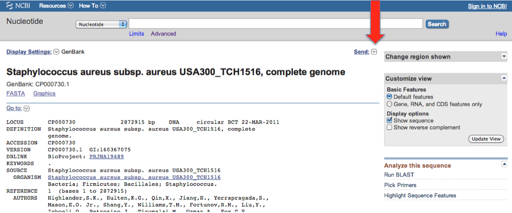
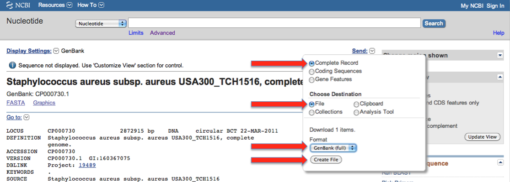

# Building databases

SnpEff needs a database to perform genomic annotations.
There are pre-built databases for thousands of genomes, so chances are that your organism of choice already has a SnpEff database available.
In the (unlikely?) event that you need to build one yourself, here we describe how to it.

!!! info
    You can know which genomes are supported by running the following command:

        java -jar snpEff.jar databases

!!! warning
    Most people do NOT need to build a database, and can safely use a pre-built one.
    So unless you are working with a rare genome you most likely don't need to do it either.

### Managing SnpEff databases manually

SnpEff databases for the most popular genomes are already pre-built and available for you to download.
So, chances are that you don't need to build a database yourself (this will save you a LOT of work).

!!! warning
    By default SnpEff automatically downloads and installs the database for you, so you don't need to do it manually.
    The following instructions are for people that want to pre-install databases manually (again, most people don't need to do this).

The easiest way to download and install a pre-built SnpEff database manually, is using the `download` command.
E.g. if you want to install the SnpEff database for the human genome, you can run the following command:

```
java -jar snpEff.jar download -v GRCh37.75
```

### Backwards compatible databases

In many cases the databases from previous SnpEff versions might be compatible with newer versions.
So, SnpEff has a *fallback* mechanism for *"backwards-compatible database formats"*.
If database format version 5.1 is backward compatible with "5.0", then we can use the "old" (5.0) databases in SnpEff version 5.1

For example, let's say GRCh38.99 was built for "SnpEff version 5.0".
When I released version 5.1 I don't need to rebuild GRCh38.99 (or any of the other thousands of databases) again for 5.1, we can just use the "old" 5.0 versions.

How does it work? SnpEff checks the database in "5.1" path, if it doesn't work it fallback to "5.0" path.
If you take a look a SnpEff's download output using the `-v` command, you'll see that it tries two times:

```
$ java -jar snpEff.jar download -v GRCm38.99

00:00:00 SnpEff version SnpEff 5.1d (build 2022-04-19 15:49), by Pablo Cingolani
00:00:00 Command: 'download'
00:00:00 Reading configuration file 'snpEff.config'. Genome: 'GRCm38.99'
00:00:00 Reading config file: /Users/pcingola/snpEff/snpEff.config
00:00:00 done
00:00:00 Downloading database for 'GRCm38.99'
00:00:00 Downloading from 'https://snpeff.blob.core.windows.net/databases/v5_1/snpEff_v5_1_GRCm38.99.zip' to local file '/var/folders/s9/y0bgs3l55rj_jkkkxr2drz4157r1dz/T//snpEff_v5_1_GRCm38.99.zip'
00:00:00 Connecting to https://snpeff.blob.core.windows.net/databases/v5_1/snpEff_v5_1_GRCm38.99.zip
00:00:01 Connecting to https://snpeff.blob.core.windows.net/databases/v5_1/snpEff_v5_1_GRCm38.99.zip, using proxy: false
00:00:01 ERROR while connecting to https://snpeff.blob.core.windows.net/databases/v5_1/snpEff_v5_1_GRCm38.99.zip
00:00:01 Downloading from 'https://snpeff.blob.core.windows.net/databases/v5_0/snpEff_v5_0_GRCm38.99.zip' to local file '/var/folders/s9/y0bgs3l55rj_jkkkxr2drz4157r1dz/T//snpEff_v5_0_GRCm38.99.zip'
00:00:01 Connecting to **https://snpeff.blob.core.windows.net/databases/v5_0/snpEff_v5_0_GRCm38.99.zip**
00:00:01 Connecting to https://snpeff.blob.core.windows.net/databases/v5_0/snpEff_v5_0_GRCm38.99.zip, using proxy: false
00:00:02 Local file name: '/var/folders/s9/y0bgs3l55rj_jkkkxr2drz4157r1dz/T//snpEff_v5_0_GRCm38.99.zip'
......
```

So, it starts searching at `https://snpeff.blob.core.windows.net/databases/v5_1/snpEff_v5_1_GRCm38.99.zip`
bu`t it doesn't find it there, so it proceeds with the databse `5.0` path `https://snpeff.blob.core.windows.net/databases/v5_0/snpEff_v5_0_GRCm38.99.zip`, where the blob is found, thus proceeds to download and install it from there.

!!! info
    If you are running SnpEff from a directory different than the one it was installed, you will have to specify where the config file is.
    This is done using the `-c` command line option:

        java -Xmx8g -jar snpEff.jar download -c path/to/snpEff/snpEff.config -v GRCh37.75

### Building a database

In order to build a database for a new genome, you need to:

!!! warning
    Most people do NOT need to build a database, and can safely use a pre-built one.
    So unless you are working with a rare genome you most likely don't need to do it either.

1. **Step 1:** [Configure a new genome](#step-1-configure-a-new-genome) in SnpEff's config file `snpEff.config`.

     1. [Add genome entry](#add-a-genome-to-the-configuration-file) to snpEff's configuration
     2. If the genome uses a non-standard codon table: [Add codon table parameter](#configuring-codon-tables-not-always-required)

2. **Step 2:** [Build using gene annotations and reference sequences](#step-2-build-using-gene-annotations-and-reference-sequences)

    1. [Option 1:](#step-2-option-1-building-a-database-from-gtf-files) Building a database from GTF files (**recommended for large genomes**)
    2. [Option 2:](#step-2-option-2-building-a-database-from-genbank-files) Building a database from GenBank files (**recommended for small genomes**)
    3. [Option 3:](#step-2-option-3-building-a-database-from-gff-files) Building a database from GFF files
    4. [Option 4:](#step-2-option-4-building-a-database-from-refseq-table-from-ucsc) Building a database from RefSeq table from UCSC

3. **Step 3:** [Checking the database](#step-3-checking-the-database): SnpEff will check the database by comparing predicted protein sequences and CDS sequences with ones provided by the user.

    1. [Checking CDS sequences](#checking-cds-sequences)
    2. [Checking Protein sequences](#checking-protein-sequences)

!!! info
    All files can be compressed using `gzip`
    E.g. the reference file 'hg19.fa' can be compressed to 'hg19.fa.gz', snpEff will automatically decompress the file.

!!! warning
    Some files claimed to be compressed using GZIP are actually not or even use a block compression variant not supported by Java's gzip library.
    If you notice that your build process finishes abruptly for no apparent reason, try uncompressing the files.

### Step 1: Configure a new genome

In order to tell SnpEff that there is a new genome available, you must update SnpEff's configuration file `snpEff.config`.

You must add a new genome entry to `snpEff.config`.

If your genome, or a chromosome, uses non-standard codon tables you must update `snpEff.config` accordingly.
A typical case is when you use mitochondrial DNA. Then you specify that chromosome 'MT' uses `codon.Invertebrate_Mitochondrial` codon table.
Another common case is when you are adding a bacterial genome, then you specify that the codon table is `Bacterial_and_Plant_Plastid`.

#### Add a genome to the configuration file

This example shows how to add a new genome to the config files. For this example we'll use the mouse genome (mm37.61):

1. Edit the config file to create the new genome:

        vi snpEff.config

    Add the following lines (you are editing snpEff.config):

        # Mouse genome, version mm37.61
        mm37.61.genome : Mouse

    !!! warning
        You may need to add codon table information for the genome or some parts of it (e.g. mitochondrial "chromosome").
        See next section for details.

2. Optional: Add genome to Galaxy's menu:

        cd /path/to/galaxy
        cd tools/snpEffect/
        vi snpEffect.xml

    Add the following lines to the file:

        <param name="genomeVersion" type="select" label="Genome">
            <option value="hg37">Human (hg37)<option>
            <option value="mm37.61">Mouse (mm37.61)<option>
        <param>

#### Configuring codon tables (not always required)

Codon tables are provided in the ```snpEff.config``` configuration file under the section ```codon.Name_of_your_codon_table```.
The format is a comma separated list of ```CODON/AMINO_ACID```.

E.g.:

    codon.Invertebrate_Mitochondrial:  TTT/F, TTC/F, TAC/Y, TAA/*, ATG/M+, ATG/M+, ACT/T, ...

Note that codons marked with '*' are STOP codons and codons marked with a '+' are START codons.

In order for you to use them, you have to specify that a given "chromosome" uses one of the tables (otherwise the default codon table is used).

E.g. Here we say the chromosome 'M' from fly genome (dm3) uses Invertebrate_Mitochondrial codon table:

    dm3.M.codonTable : Invertebrate_Mitochondrial

...of course, chromosome 'M' is not a real chromosome, it is just a way to mark the sequence as mitochondrial DNA in the reference genome.

### Step 2: Build using gene annotations and reference sequences

To build a database, SnpEff needs:

1. The reference genome sequence: This is the sequence of all chromosomes in the genome, typically in a FASTA file
2. Gene annotations files: This is the information on where the genes, transcripts and exons are in the genome. Typically, from files in GTF, GeneBank, GFF, or RefSeq formats
3. Sequences of CDS or Proteins from the genome. These are used to check that SnpEff's database is consistent and doesn't have errors  (see sections [Checking CDS sequences](#checking-cds-sequences) and [Checking Protein sequences](#checking-protein-sequences))


#### Step 2, Option 1: Building a database from GTF files

GTF 2.2 files are supported by SnpEff (e.g. ENSEMBL releases genome annotations in this format).

See a more detailed explanation about [SnpEff's requirements for GTF files here](build_db_gff_gtf.md)

1. Get the genome and uncompress it:

        # Create directory for this new genome
        cd /path/to/snpEff/data/
        mkdir mm37.61
        cd mm37.61

        # Get annotation files
        wget ftp://ftp.ensembl.org/pub/current/gtf/mus_musculus/Mus_musculus.NCBIM37.61.gtf.gz
        mv Mus_musculus.NCBIM37.61.gtf.gz genes.gtf.gz

        # Get the genome reference sequence file
        cd /path/to/snpEff/data/genomes
        wget ftp://ftp.ensembl.org/pub/current/fasta/mus_musculus/dna/Mus_musculus.NCBIM37.61.dna.toplevel.fa.gz
        mv Mus_musculus.NCBIM37.61.dna.toplevel.fa.gz mm37.61.fa.gz

2. **Note:** The FASTA file can be either in <br> `/path/to/snpEff/data/genomes/mm37.61.fa` <br>or in <br> `/path/to/snpEff/data/mm37.61/sequences.fa`
3. Add the new genome to the config file (see [Add a new genome to the configuration file](#add-a-genome-to-the-configuration-file) for details)
4. Create database:

        cd /path/to/snpEff
        java -jar snpEff.jar build -gtf22 -v mm37.61

#### Step 2, Option 2: Building a database from GenBank files

In this section, we show how to build a genome database using GeneBank files.

!!! info
    Using GeneBank files is the recommended way for databases for small genomes, such as viruses or bacteria


!!! info
    For NCBI genomes, you can use the script `buildDbNcbi.sh` that downloads and builds the database.
    See details in [this FAQ](faq.md#how-to-building-an-ncbi-genome-genbank-file)


**Example:** This example shows how to create a database for a new genome.

!!! info
    GenBank files usually include genome sequence as well as CDS sequences.
    If these sequences are NOT in the GeneBank file, you should provide separate FASTA files for genome reference and CDS (or Protein) sequences.


For this example we'll use "Staphylococcus aureus":

1. Go to NIH page for [CP000730](http://www.ncbi.nlm.nih.gov/nuccore/CP000730.1)
2. Download the features in geneBank format, by clicking as shown in the following images (red arrows):

   {: .center}

   Make sure you click the "Update" button!

   Then you go to the "Send" menu:

   {: .center}

   and then:

   {: .center}

3. Save the GenBank data to `/path/to/snpEff/data/CP000730/genes.gbk`

   **Note:** If there are more than one genbank file for an organism (e.g. multiple chromosomes), then you can download each file and concatenate them.

   E.g.: Vibrio Cholerae has two chromosomes with GenBank accessions: NC_002505.1 and NC_002506.1.
   You can download both files and save them as `snpEff/data/vibrio/NC_002505.1.gbk` and `snpEff/data/vibrio/NC_002506.1.gbk` respectively, and then concatenate both files:

        cat NC_002505.1.gbk NC_002506.1.gbk > genes.gbk

   Add the following entries in the config file:

        # Vibrio Cholerae
        vibrio.genome : Vibrio Cholerae
                vibrio.chromosomes : NC_002505.1, NC_002506.1
                vibrio.NC_002505.1.codonTable : Bacterial_and_Plant_Plastid
                vibrio.NC_002506.1.codonTable : Bacterial_and_Plant_Plastid

4. Create database (note the `-genbank` flag):

        cd /path/to/snpEff
        java -jar snpEff.jar build -genbank -v CP000730


#### Step 2, Option 3: Building a database from GFF files

!!! warning
    Using GFF is highly discouraged, we recommend you use GTF files instead (whenever possible).

See a more detailed explanation about [SnpEff's requirements for GFF files here](build_db_gff_gtf.md)

This example shows how to create a database for a new genome using GFF file (e.g. FlyBase, WormBase, BeeBase release GFF files).
For this example we'll use the Drosophila melanogaster genome (dm5.31):

1. Get a GFF file to `path/to/snpEff/data/dm5.31/genes.gff`:

        mkdir path/to/snpEff/data/dm5.31
        cd path/to/snpEff/data/dm5.31
        wget ftp://ftp.flybase.net/genomes/Drosophila_melanogaster/dmel_r5.31_FB2010_08/gff/dmel-all-r5.31.gff.gz
        mv dmel-all-r5.31.gff.gz genes.gff.gz

2. **Note:** GFF3 files can include the reference sequence in the same file. This is done by dumping the fasta file after a '##FASTA' line. You can also add the sequence fasta file to the 'data/genomes/' directory, like it is done in when using GTF format.
3. Add the new genome to the config file (see [Add a new genome to the configuration file](#add-a-genome-to-the-configuration-file) for details)
4. Create database (note the "-gff3" flag):

        cd /path/to/snpEff
        java -jar snpEff.jar build -gff3 -v dm5.31

#### Step 2, Option 4: Building a database from RefSeq table from UCSC

This example shows how to create a database for a new genome using UCSC's genome tables.
For this example we'll use the Human genome (hg19).

!!! warning
    Using UCSC genome tables is highly discouraged, we recommend you use ENSEMBL versions instead.

!!! warning
    UCSC tables sometimes change for different species.
    This means that even if these instructions work for human genome, it might not work for other genomes.
    Obviously creating a new parser for each genome is impractical, so working with UCSC genomes is highly discouraged.
    We recommend to use ENSEMBL genomes instead.

!!! warning
    UCSC genomes provide only major release version, but NOT sub-versions.
    E.g. UCSC's "hg19" has major version 19 but there is no "sub-version", whereas ENSEMBL's GRCh37.70 clearly has major version 37 and minor version 70.
    Not providing a minor version means that they might change the database and two "hg19" genomes are actually be different.
    This creates all sorts of consistency problems (e.g. the annotations may not be the same that you see in the UCSC genome browser, even though both of them are 'hg19' version).
    Using UCSC genome tables is highly discouraged, we recommend you use ENSEMBL versions instead.

In order to build a genome using UCSC tables, you can follow these instructions:

1. Go to [UCSC genome browser](http://genome.ucsc.edu/)
2. Click on "Table" menu
3. Select parameters as shown here:

    {: .center}

4. Click on "get output" and save the data to file "/path/to/snpEff/data/hg19/genes.refseq".
5. Add the fasta reference genome. The FASTA file can be either in:

    `/path/to/snpEff/data/genomes/hg19.fa`

    or in:

    `/path/to/snpEff/data/hg19/sequences.fa`

6. Add the new genome to the config file (see [Add a new genome to the configuration file](#add-a-genome-to-the-configuration-file) for details)
7. Create database (note the `-refSeq` flag):

        cd /path/to/snpEff
        java -jar snpEff.jar build -refSeq -v hg19

### Step 3: Checking the database

SnpEff makes sure that the database is built correctly by comparing the internal representation with CDS and Protein sequences.
The CDS and Protein sequences are obtained from the same source as the genome reference and gene annotation files.

IMPORTANT: When building databases, SnpEff will attempt to check the database against a CDS FASTA file and a Protein FASTA file.
If neither a CDS FASTA file nor a Protein FASTA file is provided, this check will fail and SnpEff will refuse to save the database, by showing error message like this one:

```
ERROR: CDS check file './data/MY_GENOME/cds.fa' not found.
ERROR: Protein check file './data/MY_GENOME/protein.fa' not found.
ERROR: Database check failed.
```

!!! warning
    If neither a "Protein" nor a "CDS" sequences are provided, SnpEff will not be able to check the database.
    By default, SnpEff will refuse to save any unchecked database.

You can override this behaviour by using the `build` command with these command line options:

- `-noCheckCds`: Skip CDS sequences check.
- `-noCheckProtein`: Skip Protein sequences check.
- `-noCheckCds -noCheckProtein`: When using *BOTH* command line options, SnpEff to save the new database without checking it (i.e. neither CDS nor protein sequences are checked).

#### Checking CDS sequences

When building a database, SnpEff will try to check CDS sequences for all transcripts in the database when

- building via GFT/GFF/RefSeq: A CDS sequences FASTA file is available.
- building via GenBank file: CDS sequences are available within the GenBank file

!!! info
You can disable this check unsing command line option `-noCheckCds`

FASTA cds file format:

- The file name should be `cds.fa` (or `cds.fa.gz` if compressed)
- Each transcript should have one CDS sequence
- Each FASTA header has the transcript ID either:
    - The header contains only the transcript ID
    - The header contains Transcript ID and maybe other IDs separated by either spaces, commas, colon, dots, equal sign, or some combination of these
    - Some example sequences with valid header examples:
```
>ENST00000448914
ACTGGGGGATACG

>chromosome:GRCh38:14:22449113:22449125:1 transcript:ENST00000448914.1 cds gene:ENSG00000228985.1 gene_biotype:TR_D_gene transcript_biotype:TR_D_gene gene_symbol:TRDD3 description:T cell receptor delta diversity 3
ACTGGGGGATACG
```

CSD checking output.
When run using the `-v` (verbose) command line option, for each transcript in the FASTA file, SnpEff will output one character

- `+`: OK, the CDS sequence matches the one predicted by SnpEff
- `.`: Missing transcript. SnpEff could not find the transcript ID from the FASTA file. This might indicate a problem parsing the FASTA file header to find the
- `*`: Error. The CDS sequence from inferred from SnpEff's database and the one provided in the CDS file do not match.

After these line a "Summary statistics" line shows the total number of FASTA entries checked, as well as the number of errors (and a percentage), e.g.:

```
CDS check:	GRCh38.86	OK: 94384	Warnings: 22766	Not found: 103618	Errors: 0	Error percentage: 0.0%
```

!!! warning
As a "rule of the thumb", you should not get more than 2% or 3% of errors.

!!! info
**Debugging:** You can run SnpEff using `-d` (debug) command line option to get detailed messages for each CDS sequence comparison.
The message shows the transcript ID, CDS sequence inferred by SnpEff's, and the CDS sequence from the FASTA file, as well as the places where they differ.

#### Checking Protein sequences

This is very similar to the CDS checking in the previous sub-section.
When building a database, SnpEff will also try to check Protein sequences for all transcripts when

- building via GFT/GFF/RefSeq: A protein sequences FASTA file is available.
- building via GenBank file: protein sequences are available within the GenBank file

!!! info
You can disable this check unsing command line option `-noCheckProtein`

FASTA protein file:

- The file name should be `protein.fa` (or `protein.fa.gz` if compressed)
- Each transcript should have one protein sequence
- Each FASTA header has the transcript ID either:
    - The header contains only the transcript ID
    - The header contains Transcript ID and maybe other IDs separated by either spaces, commas, colon, dots, equal sign, or some combination of these
    - Some example sequences with valid header examples (sequences have been cut for readability):
```
>ENST00000382044
MPGEQMDPTGSQLDSDFSQQDTPCLIIEDSQPESQVLEDDSGSHFSMLSRHLPNLQTHKE
NPVLDVVSNPEQTAGEERGDGNSGFNEHLKENKVADPVDSSNLDTCGSISQVIEQLPQPN
RTSSVLGMSVESAPAVEEEKGEELEQKEKEKEEDTSGNTTHSLGAEDTASSQLGFGVLEL
...

>ENSP00000371475 pep chromosome:GRCh38:15:43403061:43493171:-1 gene:ENSG00000067369 transcript:ENST00000382044 gene_biotype:protein_coding transcript_biotype:protein_coding gene_symbol:TP53BP1 description:tumor protein p53 binding protein
MPGEQMDPTGSQLDSDFSQQDTPCLIIEDSQPESQVLEDDSGSHFSMLSRHLPNLQTHKE
NPVLDVVSNPEQTAGEERGDGNSGFNEHLKENKVADPVDSSNLDTCGSISQVIEQLPQPN
RTSSVLGMSVESAPAVEEEKGEELEQKEKEKEEDTSGNTTHSLGAEDTASSQLGFGVLEL
...
```

**Protein checking output:**

When run using the `-v` (verbose) command line option, for each transcript in the FASTA file, SnpEff will output one character:

- `+`: OK, the protein sequence matches the one predicted by SnpEff
- `.`: Missing transcript. SnpEff could not find the transcript ID from the FASTA file. This might indicate a problem parsing the FASTA file header to find the
- `*`: Error. The Protein sequence from inferred from SnpEff's database and the one provided in the protein file do not match.

After these line a "Summary statistics" line shows the total number of FASTA entries checked, as well as the number of errors (and a percentage), e.g.:
```
Protein check:  GRCh38.86       OK: 94371       Not found: 0    Errors: 13      Error percentage: 0.01377352093575182%
```

!!! warning
As a "rule of the thumb", the errors should be below 2% or 3%.

**How exactly protein sequences are compared**
The rules used for protein sequence comparison are:

- Comparison is case-insensitive
- Trailing STOP codon (`'*'`) is removed
- Trailing incomplete codon (`'?'`) is removed
- Leading incomplete codons (`'?'`) are removed

If these comparisons fails, further attempts are made:

- Replace "unknown" codon characters: Codons using old `'X'` characters are replaced by newer `'?'` characters
- If any of the sequences only differ by the first codon, they are considered equal (the start codon is translates as 'Met' even when the codon code translates to another Amino acid)
- Replace rare amino acids, which often tranlate as stop codons in the middle of the sequence: E.g. replace `'*'` by `'U'`
- Try replacing unknown aminco acids (`'?'`) by the ones at the same position in the protein sequence from the FASTA file

If after all these attempts the protein sequence still do not match, they are considered "not equal".

!!! info
**Debugging:** You can run SnpEff using `-d` (debug) command line option to get detailed messages for each protein sequence comparison.
The message shows the transcript ID, protein sequence inferred by SnpEff's, and the protein sequence from the FASTA file, as well as the places where they differ.


### Example: Building the Human Genome database

This is a full example on how to build the human genome database (using GTF file from ENSEBML), it includes support for regulatory features, sanity check, rare amino acids, etc..
```
# Go to SnpEff's install dir
cd ~/snpeff

# Create database dir
mkdir data/GRCh37.70
cd data/GRCh37.70

# Download annotated genes
wget ftp://ftp.ensembl.org/pub/release-70/gtf/homo_sapiens/Homo_sapiens.GRCh37.70.gtf.gz
mv Homo_sapiens.GRCh37.70.gtf.gz genes.gtf.gz

# Download proteins
# This is used for:
#	- "Rare Amino Acid" annotations
#	- Sanity check (checking protein predicted from DNA sequences match 'real' proteins)
wget ftp://ftp.ensembl.org/pub/release-70/fasta/homo_sapiens/pep/Homo_sapiens.GRCh37.70.pep.all.fa.gz
mv Homo_sapiens.GRCh37.70.pep.all.fa.gz protein.fa.gz

# Download CDSs
# Note: This is used as "sanity check" (checking that CDSs predicted from gene sequences match 'real' CDSs)
wget ftp://ftp.ensembl.org/pub/release-70/fasta/homo_sapiens/cdna/Homo_sapiens.GRCh37.70.cdna.all.fa.gz
mv Homo_sapiens.GRCh37.70.cdna.all.fa.gz cds.fa.gz

# Download regulatory annotations
wget ftp://ftp.ensembl.org/pub/release-70/regulation/homo_sapiens/AnnotatedFeatures.gff.gz
mv AnnotatedFeatures.gff.gz regulation.gff.gz

# Uncompress
gunzip *.gz

# Download genome
cd ../genomes/
wget ftp://ftp.ensembl.org/pub/release-70/fasta/homo_sapiens/dna/Homo_sapiens.GRCh37.70.dna.toplevel.fa.gz
mv Homo_sapiens.GRCh37.70.dna.toplevel.fa.gz GRCh37.70.fa.gz

# Uncompress:
# Why do we need to uncompress?
# Because ENSEMBL compresses files using a block compress gzip which is not compatible with Java's library Gunzip
gunzip GRCh37.70.fa.gz

# Edit snpEff.config file
#
# WARNING! You must do this yourself. Just copying and pasting this into a terminal won't work.
#
# Add lines:
#		GRCh37.70.genome : Homo_sapiens
#		GRCh37.70.reference : ftp://ftp.ensembl.org/pub/release-70/gtf/

# Now we are ready to build the database
cd ~/snpeff
java -Xmx20g -jar snpEff.jar build -v GRCh37.70 2>&1 | tee GRCh37.70.build
```

### Troubleshooting Database builds

!!! warning
    By far the most common problem is that the FASTA file chromosome names are different than the GFF chromosome names.
    Make sure chromosome names are consistent in all the files you use.

**When I build the database using GFF 3 SnpEff reports that Exons don't have sequences**

GFF3 files can have sequence information either in the same file or in a separate fasta file.

In order to add sequence information in the GFF file, you can do this:
```
cat annotations.gff > genes.gff
echo "###"  >> genes.gff
echo "##FASTA"  >> genes.gff
cat sequence.fa  >> genes.gff
```
**When building a database, I get zero protein coding genes**

When building a database, snpEff tries to find which transcripts are protein coding. This is done using the 'bioType' information.

The bioType information is not a standard GFF or GTF feature. So I follow ENSEMBL's convention of using the second column ('source') for bioType, as well as the gene_biotype attribute.

If your file was not produced by ENSEMBL, it probably doesn't have this information. This means that snpEff doesn't know which genes are protein coding and which ones are not.

Having no information, snpEff will treat all genes as protein coding (assuming you have `-treatAllAsProteinCoding Auto` option in the command line, which is the default).

So you will get effects as if all genes were protein coding, then you can filter out the irrelevant genes. Unfortunately, this is the best I can do if there is no 'bioType' information

**When building a database, I get too many warnings**

There are plenty of GFF and GTF files that, unfortunately, do not follow the specification.
SnpEff usually complains about this, but tries hard to correct the problems.
So the database may be OK even after you see many warnings.

You can check the database to see if the features (genes, exons, UTRs) have been correctly incorporated, by taking a look at the database:

    java -jar snpEff.jar dump myGenome | less
