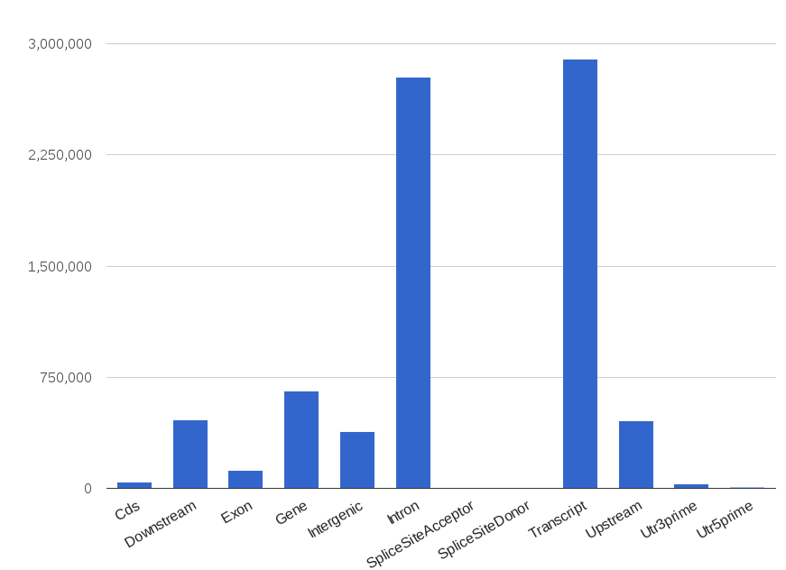

# Commands and utilities

SnpEff provides several other commands and utilities that can be useful for genomic data analysis.

Most of this manual was dedicated the `SnpEff eff` and `SnpEff build` commands, which annotate effects and build databases respectively.
Here we describe all the other commands and some scripts provided, that are useful for genomic data analysis.

### SnpEff closest

Annotates using the closest genomic region (e.g. exon, transcript ID, gene name) and distance in bases.

Example:
```
$ java -Xmx8g -jar snpEff.jar closest GRCh37.66 test.vcf
##INFO=<ID=CLOSEST,Number=4,Type=String,Description="Closest exon: Distance (bases), exons Id, transcript Id, gene name">
1       12078   .       G       A       25.69   PASS    AC=2;AF=0.048;CLOSEST=0,exon_1_11869_12227,ENST00000456328,DDX11L1
1       16097   .       T       G       42.42   PASS    AC=9;AF=0.0113;CLOSEST=150,exon_1_15796_15947,ENST00000423562,WASH7P
1       40261   .       C       A       366.26  PASS    AC=30;AF=0.484;CLOSEST=4180,exon_1_35721_36081,ENST00000417324,FAM138A
1       63880   .       C       T       82.13   PASS    AC=10;AF=0.0400;CLOSEST=0,exon_1_62948_63887,ENST00000492842,OR4G11P
```

For instance, in the third line (1:16097 T G), it added the tag `CLOSEST=150,exon_1_15796_15947,ENST00000423562,WASH7P`
, which means that the variant is 150 bases away from exon "exon_1_15796_15947".
The exon belongs to transcript "ENST00000423562" of gene "WASH7P".

!!! info
    If multiple markers are available (at the same distance) the one belonging to the longest mRna transcript is shown.

The input can also be a BED file, the output file has the same information as CLOSEST info field, added to the fourth column of the output BED file:
```
$ snpeff closest -bed GRCh37.66 test.bed
1	12077	12078	line_1;0,exon_1_11869_12227,ENST00000456328,DDX11L1
1	16096	16097	line_2;150,exon_1_15796_15947,ENST00000423562,WASH7P
1	40260	40261	line_3;4180,exon_1_35721_36081,ENST00000417324,FAM138A
1	63879	63880	line_4;0,exon_1_62948_63887,ENST00000492842,OR4G11P
```

### SnpEff count

As the name suggests, `snpEff count` command counts how many reads and bases from a BAM file hit a gene, transcript, exon, intron, etc.
Input files can be in BAM, SAM, VCF, BED or BigBed formats.

A summary HTML file with charts is generated. Here are some examples:

{: .smallerimg .center}

{: .smallerimg .center}

If you need to count how many reads (and bases) from a BAM file hit each genomic region, you can use 'count' utility.

The command line is quite simple. E.g. in order to count how many reads (from N BAM files) hit regions of the human genome, you simply run:

    java -Xmx8g -jar snpEff.jar count GRCh37.68 readsFile_1.bam readsFile_2.bam ...  readsFile_N.bam > countReads.txt

The output is a TXT (tab-separated) file, that looks like this:
```
chr  start  end       type                IDs                         Reads:readsFile_1.bam  Bases:readsFile_1.bam  Reads:readsFile_2.bam  Bases:readsFile_2.bam ...
1    1      11873     Intergenic          DDX11L1                     130                    6631                   50                     2544
1    1      249250621 Chromosome          1                           2527754                251120400              2969569                328173439
1    6874   11873     Upstream            NR_046018;DDX11L1           130                    6631                   50                     2544
1    9362   14361     Downstream          NR_024540;WASH7P            243                    13702                  182                    9279
1    11874  12227     Exon                exon_1;NR_046018;DDX11L1    4                      116                    2                      102
1    11874  14408     Gene                DDX11L1                     114                    7121                   135                    6792
1    11874  14408     Transcript          NR_046018;DDX11L1           114                    7121                   135                    6792
1    12228  12229     SpliceSiteDonor     exon_1;NR_046018;DDX11L1    3                      6                      0                      0
1    12228  12612     Intron              intron_1;NR_046018;DDX11L1  13                     649                    0                      0
1    12611  12612     SpliceSiteAcceptor  exon_2;NR_046018;DDX11L1    0                      0                      0                      0
1    12613  12721     Exon                exon_2;NR_046018;DDX11L1    3                      24                     1                      51
1    12722  12723     SpliceSiteDonor     exon_2;NR_046018;DDX11L1    3                      6                      0                      0
1    12722  13220     Intron              intron_2;NR_046018;DDX11L1  22                     2110                   20                     987
1    13219  13220     SpliceSiteAcceptor  exon_3;NR_046018;DDX11L1    5                      10                     1                      2
1    13221  14408     Exon                exon_3;NR_046018;DDX11L1    82                     4222                   113                    5652
1    14362  14829     Exon                exon_11;NR_024540;WASH7P    37                     1830                   7                      357
1    14362  29370     Transcript          NR_024540;WASH7P            704                    37262                  524                    34377
1    14362  29370     Gene                WASH7P                      704                    37262                  524                    34377
1    14409  19408     Downstream          NR_046018;DDX11L1           122                    7633                   39                     4254
```
The columns are:

* Column 1: Chromosome name
* Column 2: Genomic region start
* Column 3: Genomic region end
* Column 4: Genomic region type (e.g. Exon, Gene, SpliceSiteDonor, etc.)
* Column 5: ID (e.g. exon ID ; transcript ID; gene ID)
* Column 6: Count of reads (in file readsFile_1.bam) intersecting genomic region.
* Column 7: Count of bases (in file readsFile_1.bam) intersecting genomic region, i.e. each read is intersected and the resulting number of bases added.
* Column ...:  (repeat count reads and bases for each BAM file provided)

**Totals and Binomial model**

Using command line option `-p`, you can calculate p-values based on a Binomial model.
For example (output edited for the sake of brevity):
```
$ java -Xmx8g -jar snpEff.jar count -v BDGP5.69 fly.bam > countReads.txt
00:00:00.000	Reading configuration file 'snpEff.config'
...
00:00:12.148	Calculating probability model for read length 50
...
type               p.binomial             reads.fly  expected.fly  pvalue.fly
Chromosome         1.0                    205215     205215        1.0
Downstream         0.29531659795589793    59082      60603         1.0
Exon               0.2030262729897713     53461      41664         0.0
Gene               0.49282883664487515    110475     101136        0.0
Intergenic         0.33995644860241336    54081      69764         0.9999999963234701
Intron             0.3431415343615103     72308      70418         9.06236369003514E-19
RareAminoAcid      9.245222303207472E-7   3          0             9.879186871519377E-4
SpliceSiteAcceptor 0.014623209601955131   3142       3001          0.005099810118785825
SpliceSiteDonor    0.015279075154423956   2998       3135          0.9937690786738507
Transcript         0.49282883664487515    110475     101136        0.0
Upstream           0.31499087549896493    64181      64641         0.9856950416729887
Utr3prime          0.03495370828296416    8850       7173          1.1734134297889064E-84
Utr5prime          0.02765432673262785    8146       5675          7.908406840800345E-215
```

The columns in for this table are (in the previous example the input file was 'fly.bam' so fileName is 'fly'):

* type : Type of interval
* p.binomial : Probability that a random read hits this 'type' of interval (in binomial model)
* reads.fileName : Total number of reads in 'fileName' (user provided BAM/SAM file)
* expected.fileName : Expected number of reads hitting this 'type' of interval (for user provided BAM/SAM file)
* pvalue.fileName : p-value that 'reads.fileName' reads or more hit this 'type' of interval (for user provided BAM/SAM file)
* Column ...:  (repeat last three column for each BAM/SAM file provided by the user)

**User defined intervals**

You can add user defined intervals using `-i file.bed` command line option.
The option can be used multiple times, thus allowing multiple BED files to be added.

Example : You want to know how many reads intersect each peak from a peak detection algorithm:

    java -Xmx8g -jar snpEff.jar count -i peaks.bed GRCh37.68 reads.bam

### SnpEff databases

This command provides a list of configured databases, i.e. available in `snpEff.config` file.

Example:
```
$ java -jar snpEff.jar databases
Genome                                                      Organism                                                    Status    Bundle                        Database download link
------                                                      --------                                                    ------    ------                        ----------------------
129S1_SvImJ_v1.99                                           Mus_musculus_129s1svimj                                                                             https://snpeff.blob.core.windows.net/databases/v5_0/snpEff_v5_0_129S1_SvImJ_v1.99.zip
AIIM_Pcri_1.0.99                                            Pavo_cristatus                                                                                      https://snpeff.blob.core.windows.net/databases/v5_0/snpEff_v5_0_AIIM_Pcri_1.0.99.zip
AKR_J_v1.99                                                 Mus_musculus_akrj                                                                                   https://snpeff.blob.core.windows.net/databases/v5_0/snpEff_v5_0_AKR_J_v1.99.zip
AP006557.1                                                  SARS coronavirus TWH genomic RNA, complete genome.                                                                  https://snpeff.blob.core.windows.net/databases/v5_0/snpEff_v5_0_AP006557.1.zip
AP006558.1                                                  SARS coronavirus TWJ genomic RNA, complete genome.                                                                  https://snpeff.blob.core.windows.net/databases/v5_0/snpEff_v5_0_AP006558.1.zip
AP006559.1                                                  SARS coronavirus TWK genomic RNA, complete genome.                                                                  https://snpeff.blob.core.windows.net/databases/v5_0/snpEff_v5_0_AP006559.1.zip
AP006560.1                                                  SARS coronavirus TWS genomic RNA, complete genome.                                                                  https://snpeff.blob.core.windows.net/databases/v5_0/snpEff_v5_0_AP006560.1.zip
AP006561.1                                                  SARS coronavirus TWY genomic RNA, complete genome.                                                                  https://snpeff.blob.core.windows.net/databases/v5_0/snpEff_v5_0_AP006561.1.zip
...
```

### SnpEff download

This command downloads and installs a database.

!!! warning
    Note that the database must be configured in `snpEff.config` and available at the download site.

Example: Download and install C.Elegans genome:
```
$ java -jar snpEff.jar download -v WBcel215.69
00:00:00.000	Downloading database for 'WBcel215.69'
00:00:00.002	Connecting to http://downloads.sourceforge.net/project/snpeff/databases/v3_1/snpEff_v3_1_WBcel215.69.zip
00:00:00.547	Copying file (type: application/zip, modified on: Sat Dec 01 20:59:55 EST 2012)
00:00:00.547	Local file name: 'snpEff_v3_1_WBcel215.69.zip'
00:00:01.949	Downloaded 1049506 bytes
00:00:03.624	Downloaded 2135266 bytes
00:00:05.067	Downloaded 3185026 bytes
00:00:06.472	Downloaded 4234786 bytes
00:00:07.877	Downloaded 5284546 bytes
00:00:09.580	Downloaded 6374626 bytes
00:00:11.005	Downloaded 7424386 bytes
00:00:12.410	Downloaded 8474146 bytes
00:00:13.815	Downloaded 9523906 bytes
00:00:15.358	Downloaded 10604226 bytes
00:00:16.761	Downloaded 11653666 bytes
00:00:18.168	Downloaded 12703426 bytes
00:00:19.573	Downloaded 13753186 bytes
00:00:21.198	Downloaded 14837506 bytes
00:00:22.624	Downloaded 15887266 bytes
00:00:24.029	Downloaded 16937026 bytes
00:00:25.434	Downloaded 17986786 bytes
00:00:26.864	Downloaded 19036546 bytes
00:00:28.269	Downloaded 20086306 bytes
00:00:29.155	Donwload finished. Total 20748168 bytes.
00:00:29.156	Local file name: '/home/pcingola//snpEff/data/WBcel215.69/snpEffectPredictor.bin'
00:00:29.156	Extracting file 'data/WBcel215.69/snpEffectPredictor.bin' to '/home/pcingola//snpEff/data/WBcel215.69/snpEffectPredictor.bin'
00:00:29.157	Creating local directory: '/home/pcingola/snpEff/data/WBcel215.69'
00:00:29.424	Unzip: OK
00:00:29.424	Done
```

### SnpEff dump

Dump the contents of a database to a text file, a BED file or a tab separated TXT file (that can be loaded into R).

**BED file example**:
```
$ java -jar snpEff.jar download -v GRCh37.70
$ java -Xmx8g -jar snpEff.jar dump -v -bed GRCh37.70 > GRCh37.70.bed
00:00:00.000	Reading database for genome 'GRCh37.70' (this might take a while)
00:00:32.476	done
00:00:32.477	Building interval forest
00:00:45.928	Done.
```

The output file looks like a typical BED file (chr \t start \t end \t name).

!!! warning
    Keep in mind that BED file coordinates are zero based, semi-open intervals.
    So a 2 base interval at (one-based) positions 100 and 101 is expressed as a BED interval `[99 - 101]`.

```
$ head GRCh37.70.bed
1	0	249250621	Chromosome_1
1	111833483	111863188	Gene_ENSG00000134216
1	111853089	111863002	Transcript_ENST00000489524
1	111861741	111861861	Cds_CDS_1_111861742_111861861
1	111861948	111862090	Cds_CDS_1_111861949_111862090
1	111860607	111860731	Cds_CDS_1_111860608_111860731
1	111861114	111861300	Cds_CDS_1_111861115_111861300
1	111860305	111860427	Cds_CDS_1_111860306_111860427
1	111862834	111863002	Cds_CDS_1_111862835_111863002
1	111853089	111853114	Utr5prime_exon_1_111853090_111853114
```

**TXT file example**:
```
$ java -Xmx8g -jar snpEff.jar dump -v -txt GRCh37.70 > GRCh37.70.txt
00:00:00.000	Reading database for genome 'GRCh37.70' (this might take a while)
00:00:31.961	done
00:00:31.962	Building interval forest
00:00:45.467	Done.
```
In this case, the output file looks like a typical BED file (chr \t start \t end \t name):
```
$ head GRCh37.70.txt
chr start       end        strand  type         id                          geneName  geneId            numberOfTranscripts  canonicalTranscriptLength  transcriptId     cdsLength  numerOfExons  exonRank  exonSpliceType
1   1           249250622  +1      Chromosome   1                                                                                                       
1   111833484   111863189  +1      Gene         ENSG00000134216             CHIA      ENSG00000134216   10                   1431                                                                  
1   111853090   111863003  +1      Transcript   ENST00000489524             CHIA      ENSG00000134216   10                   1431                       ENST00000489524  862        9                     
1   111861742   111861862  +1      Cds          CDS_1_111861742_111861861   CHIA      ENSG00000134216   10                   1431                       ENST00000489524  862        9                     
1   111861949   111862091  +1      Cds          CDS_1_111861949_111862090   CHIA      ENSG00000134216   10                   1431                       ENST00000489524  862        9                     
1   111853090   111853115  +1      Utr5prime    exon_1_111853090_111853114  CHIA      ENSG00000134216   10                   1431                       ENST00000489524  862        9             1         ALTTENATIVE_3SS
1   111854311   111854341  +1      Utr5prime    exon_1_111854311_111854340  CHIA      ENSG00000134216   10                   1431                       ENST00000489524  862        9             2         SKIPPED
1   111860608   111860732  +1      Exon         exon_1_111860608_111860731  CHIA      ENSG00000134216   10                   1431                       ENST00000489524  862        9             5         RETAINED
1   111853090   111853115  +1      Exon         exon_1_111853090_111853114  CHIA      ENSG00000134216   10                   1431                       ENST00000489524  862        9             1         ALTTENATIVE_3SS
1   111861742   111861862  +1      Exon         exon_1_111861742_111861861  CHIA      ENSG00000134216   10                   1431                       ENST00000489524  862        9             7         RETAINED
```

The format is:

Column                    | Meaning
------------------------- | -----------
chr                       | Chromosome name
start                     | Marker start (one-based coordinate)
end                       | Marker end (one-based coordinate)
strand                    | Strand (positive or negative)
type                      | Type of marker (e.g. exon, transcript, etc.)
id                        | ID. E.g. if it's a Gene, then it may be ENSEBML's gene ID
geneName                  | Gene name, if marker is within a gene (exon, transcript, UTR, etc.), empty otherwise (e.g. intergenic)
geneId                    | Gene is, if marker is within a gene
numberOfTranscripts       | Number of transcripts in the gene
canonicalTranscriptLength | CDS length of canonical transcript
transcriptId              | Transcript ID, if marker is within a transcript
cdsLength                 | CDS length of the transcript
numerOfExons              | Number of exons in this transcript
exonRank                  | Exon rank, if marker is an exon
exonSpliceType            | Exon splice type, if marker is an exon


### SnpEff genes2bed

Dumps a selected set of genes as BED intervals.

!!! warning
    The functionality of this command is a subset of `SnpEff dump`, so it is likely to be deprecated in the future.

Example:
```
$ java -Xmx8g -jar snpEff.jar genes2bed GRCh37.66 DDX11L1 WASH7P
#chr	start	end	geneName;geneId
1	11868	14411	DDX11L1;ENSG00000223972
1	14362	29805	WASH7P;ENSG00000227232
```

### SnpEff cds &amp; SnpEff protein

These commands perform SnpEff database sanity checks.
They calculate CDS and protein sequences from a SnpEff database and then compare the results to a FASTA file (having the "correct" sequences).

The commands are invoked automatically when building databases, so there is no need for the user to invoke them manually.

### SnpEff len

Calculates the genomic length of every type of marker (Gene, Exon, Utr, etc.).
Length is calculated by overlapping all markers and counting the number of bases (e.g. a base is counted as 'Exon' if any exon falls onto that base).
This command also reports the probability of a Binomial model.

!!! info
    Parameter `-r num` adjusts the model for a read length of 'num' bases. That is, if two markers of the same type are closer than 'num' bases, it joins them by inclining the bases separating them.

E.g.:
```
$ java -Xmx1g -jar snpEff.jar len -r 100 BDGP5.69
marker                   size    count     raw_size raw_count    binomial_p
Cds                  22767006    56955     45406378    122117    0.13492635563570918
Chromosome          168736537       15    168736537        15    1.0
Downstream           49570138     5373    254095562     50830    0.29377240330587084
Exon                 31275946    61419     63230008    138474    0.18535372691689175
Gene                 82599213    11659     87017182     15222    0.4895158717166277
Intergenic           56792611    11637     56792611     11650    0.3365756581812509
Intron               55813748    42701    168836797    113059    0.33077452573297744
SpliceSiteAcceptor      97977    48983       226118    113059    5.806507691929223E-4
SpliceSiteDonor        101996    50981       226118    113059    6.044689657225808E-4
Transcript           82599213    11659    232066805     25415    0.4895158717166277
Upstream             52874082     5658    254044876     50830    0.3133528928592389
Utr3prime             5264120    13087     10828991     24324    0.031197274126824114
Utr5prime             3729197    19324      6368070     33755    0.02210070839607192
```
Column meaning:

* marker : Type of marker interval
* size : Size of all intervals in the genome, after overlap and join.
* count : Number of intervals in the genome, after overlap and join.
* raw_size : Size of all intervals in the genome. Note that this could be larger than the genome.
* raw_count : Number of intervals in the genome.

### Scripts

Several scripts are provided in the `scripts` directory.
Here we briefly describe their functionality:

#### sam2fastq.pl

Convert a SAM input to a FASTQ output. Example:
```
samtools view test.bam | ./scripts/bam2fastq.pl | head -n 12
@HWI-ST1220:76:D12CHACXX:7:2207:18986:95756
CGACAATGCACGACAGAGGAAGCAGAACAGATATTTAGATTGCCTCTCATT
+
CCCFFFFFGHHHHIIJIJJIJIJJIJJIIIJIIHIJJJIJJIJJJJJJIJJ
@HWI-ST1220:76:D12CHACXX:7:2206:4721:162268
ATATTATAGGGAGAAATATGATCGCGTATGCGAGAGTAGTGCCAACATATT
+
@@@DDD>DAB;?DGGEGGBCD>BFGI?FCFFBFGG@<?B*?BFB9FGII@E
@HWI-ST1220:76:D12CHACXX:7:1304:13069:17740
ATAGGGAGAAATATGATCGCGTATGCGAGAGTAGTGCCAACATATTGTGCT
+
CCCFFFFFHHHHHJJJJJJJJGIJJJJJJAGBGGIIIJJJJJJJJJJJIJG
```

#### fasta2tab.pl

Convert a fasta file to a two column tab-separated TXT file (name \t sequence)

Example (output truncated for brevity):
```
$ zcat ce6.fa.gz | ./scripts/fasta2tab.pl
chrI    gcctaagcctaagcctaagcctaagcctaagcctaagcctaagcct...
chrV    GAATTcctaagcctaagcctaagcctaagcctaagcctaagcctaa...
chrII   cctaagcctaagcctaagcctaagcctaagcctaagcctaagccta...
chrM    CAGTAAATAGTTTAATAAAAATATAGCATTTGGGTTGCTAAGATAT...
chrX    ctaagcctaagcctaagcctaagcctaagcctaagcctaagcctaa...
chrIV   cctaagcctaagcctaagcctaagcctaagcctaagcctaagccta...
chrIII  cctaagcctaagcctaagcctaagcctaagcctaagcctaagccta...
```

#### fastaSplit.pl

Split a multiple sequence FASTA file to individual files.

Example: Creates one file per chromosome:
```
$ zcat ce6.fa.gz | ./scripts/fastaSplit.pl
Writing to chrI.fa
Writing to chrV.fa
Writing to chrII.fa
Writing to chrM.fa
Writing to chrX.fa
Writing to chrIV.fa
Writing to chrIII.fa
```

#### plotHistogram.pl

Given a list of numbers (one per line), shows a histogram. Note: It requires R.

Example: Extract the file sizes in a directory and show a histogram

    $ ls -al scripts/ | tr -s " " | cut -f 5 -d " " | ./scripts/hist.pl

Creates the following plot:
{: .smallerimg .center}

#### plotMA.pl, plot.pl, plotQQ.pl, plotSmoothScatter.pl
Similar to 'hist.pl', these perform plots based on input from STDIN.
Note that in some cases, inputs are expected to be probabilities (qqplot.pl) or pairs of numbers (maPlot.pl).

    $ ls -al scripts/ | tr -s " " | cut -f 5 -d " " | ./scripts/plot.pl

Creates the following plot:
{: .smallerimg .center}

#### queue.pl

Process a list of statements in parallel according to the number of CPUs available in the local machine.

####  splitChr.pl

Splits a file by chromosome. Works on any tab separated file that the first column is CHR field (e.g. BED, VCF, etc.)

Example:
```
$ cat large_test.vcf | ./scripts/splitChr.pl
Input line 28. Creating file 'chr1.txt'
Input line 13332. Creating file 'chr2.txt'
Input line 22097. Creating file 'chr3.txt'
Input line 29289. Creating file 'chr4.txt'
Input line 34236. Creating file 'chr5.txt'
Input line 39899. Creating file 'chr6.txt'
Input line 47120. Creating file 'chr7.txt'
Input line 53371. Creating file 'chr8.txt'
Input line 57810. Creating file 'chr9.txt'
Input line 63005. Creating file 'chr10.txt'
Input line 68080. Creating file 'chr11.txt'
Input line 76629. Creating file 'chr12.txt'
Input line 83071. Creating file 'chr13.txt'
Input line 85124. Creating file 'chr14.txt'
Input line 89281. Creating file 'chr15.txt'
Input line 93215. Creating file 'chr16.txt'
Input line 99081. Creating file 'chr17.txt'
Input line 106405. Creating file 'chr18.txt'
Input line 108330. Creating file 'chr19.txt'
Input line 118568. Creating file 'chr20.txt'
Input line 121795. Creating file 'chr21.txt'
Input line 123428. Creating file 'chr22.txt'
Input line 126520. Creating file 'chrX.txt'
Input line 129094. Creating file 'chrY.txt'
Input line 129113. Creating file 'chrMT.txt'
```

#### uniqCount.pl

Count number of unique lines. It's the same as doing `cat lines.tst | sort | uniq -c `, but much faster. Particularly useful for very large inputs.

#### vcfEffOnePerLine.pl

Splits EFF fields in a VCF file, creating multiple lines, each one with only one effect.

Very useful for filtering with SnpSift.

Example:

```
$ cat test.stop.vcf
1	897062	.	C	T	100.0	PASS	AC=1;EFF=STOP_GAINED(HIGH|NONSENSE|Cag/Tag|Q141*|642|KLHL17||CODING|NM_198317|),UPSTREAM(MODIFIER||||576|PLEKHN1||CODING|NM_001160184|),UPSTREAM(MODIFIER||||611|PLEKHN1||CODING|NM_032129|),UPSTREAM(MODIFIER||||749|NOC2L||CODING|NM_015658|)

$ cat test.stop.vcf | ./scripts/vcfEffOnePerLine.pl
1	897062	.	C	T	100.0	PASS	AC=1;EFF=STOP_GAINED(HIGH|NONSENSE|Cag/Tag|Q141*|642|KLHL17||CODING|NM_198317|)
1	897062	.	C	T	100.0	PASS	AC=1;EFF=UPSTREAM(MODIFIER||||576|PLEKHN1||CODING|NM_001160184|)
1	897062	.	C	T	100.0	PASS	AC=1;EFF=UPSTREAM(MODIFIER||||611|PLEKHN1||CODING|NM_032129|)
1	897062	.	C	T	100.0	PASS	AC=1;EFF=UPSTREAM(MODIFIER||||749|NOC2L||CODING|NM_015658|)
```
