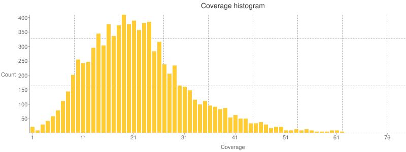

# Output summary files

SnpEff creates an additional output file showing overall statistics.
This "stats" file is an HTML file which can be opened using a web browser.
It can also be created as a CSV file, for easier parsing or manipulation.
You can find an example of a 'stats' file [here](../adds/1kg.html).

## Summary file options

By default, SnpEff performs some statistics and saves them to the `snpEff_summary.html` on the same directory where snpEff is being executed.
You can see the file, by opening it in your browser. SnpEff also creates a "Genes Statistics" file (`snpEff_genes.txt`) with gene-level statistics in tabular (tab-separated) format.

There are some command line options related to the statistics:

- `-stats <file>`: You can change the default name and location of the HTML file. This also changes the name and location of the "genes" (TXT) file.
- `-noStats`: Do not calculate statisticsm, or create stats (summary) files
- `-csvStats <file>`: Create the statistics file in CSV format with the specified name.

!!! info
    The "Genes statistics" file path is by default the directory where SnpEff is executed and called `snpEff_genes.txt`. If you change the summary file name / path by either using `-stats` or `csvStats` command line, the "Genes statistics" file path will be the same directory as the summary file and the file name is the same "base name" plus a `".genes.txt"`.


## Summary report

The summary report consist of several sections:

- [Main summary table](#main-summary-table)
- Variant rate by chromosome: A table of number of variants and variants rate per chromosome
- [Variants by type](#variants-by-type)
- Number of variants by impact: A count and percentage of variants by [impact](./inputoutput.md#impact-prediction)
- Number of variants by functional class: A count and percentage of variants by [functional class](./inputoutput.md#functional-class)
- [Number of variants by annotation](#annotations--region)
- Quality histogram: Variant Quality histogram, i.e. a histogram of the VCF's  `QUAL` field
- InDel length histogram: Length of `INS` and `DEL` variants
- Base variant table: Table of SNV variants changes
- Transition vs transversions (ts/tv): Transition vs transversions table, split into "known" and all variants (known variants are the ones with non-empty `ID` field).
- Allele frequency: Allele frequency histogram
- Allele Count: Allele count histogram
- Codon change table: A table of all codon changes counts
- Amino acid change table: A table of all amino acid changes counts
- Chromosome variants plots: Plots of number of variants for each chromosome location
- Details by gene: Link to "Genes Statistics" file

## Main summary table

The main summary table contains basic information about the SnpEff run and some overall statistics:

| Table Entry                         | Note  |
| ------------------------------------| ----- | 
| Genome                              | Genome name and version, as specified in the command line | 
| Date                                | Date and time when the analysis was performed |
| SnpEff version                      | SnpEff version |
| Command line arguments              | Command line arguments and options used to annotate |
| Warnings                            | Number of [WARNING](./inputoutput.md#errors-and-warnings) annotation messages (i.e. `WARNING` messages in the ANN field) |
| Errors                              | Number of [ERROR](./inputoutput.md#errors-and-warnings) annotation messages (i.e. `ERROR` messages in the ANN field) |
| Number of lines (input file)        | Number of lines in the input file, excluding comment / header lines |
| Number of variants (before filter)  | Number of variants in the input file. Note that this can differ from the number of lines; e.g. VCF allows for [multiple variants per line](./faq.md#counting-variants-vs-lines-in-a-vcf-file) and [IUPAC expansion](./faq#iupac-expansion). |
| Number of not variants              | Number of non-variants, e.g. if the `REF` and `ALT` fields are the same |
| Number of variants processed        | Number of variants processed. This can be different than the number of variants due to filtering and non-variants entries. |
| Number of known variants            | Variants that have a non-empty `ID` field. |
| Number of multi-allelic VCF entries | Variants that have mode then two alleles. Most variants have only two alleles: `REF` and one `ALT`. Multi-allelic variants have multiple `ALT` entries. |
| Number of annotations               | Total number of variant annotations. Note that this is typically [higher than the number of variant](./faq.md#counting-variants-vs-annotations) |
| Genome total length                 | Total genome length (in bases) |
| Genome effective length             | Total length of the chromosomes (in bases). This only counts chromosomes that had varinats |
| Variant rate                        | Number of variants per genomic length: `Number of variants` / `Genome effeective length`|


!!! warning
    The number of input lines, number of variants, and number of annotation are different counts and typically are not equal, [see details in this FAQ](./faq.md#number-of-variants-in-vcf-and-html-summary-do-not-match)

### Variants by type

This table contains a list of the number of variants, grouped by variant type:

| Type       | Note |
| ---------- | ---- |
| `SNP`      | SNP / SNV is a single nucleotide variant, e.g. 'A -> G' |
| `MNP`      | MNP / MNV is a multiple nucleotide variant, e.g. 'AC -> GT' |
| `INS`      | Insertion, e.g. 'A -> AT' |
| `DEL`      | Deletion, e.g. 'AT -> A' |
| `MIXED`    | A mixed vairant is a combination of SNP / MNP / INS / DEL, for example ' |
| `INV`      | An inversion of reference sequence |
| `DUP`      | A duplication is a region of elevated copy number relative to the reference |
| `BND`      | An arbitrary rearrangement |
| `INTERVAL` | An interval marke, e.g. an interval from a BED file |


### Histograms

E.g.: In the stats file, you can see coverage histogram plots like this one:



### Annotations & Region

SnpEff annotates variants using ["functional annotaions"](./inputoutput.md#variant-annotaiton-details), e.g. `NON_SYNONYMOUS_CODING`, `STOP_GAINED`, etc..
These variants affect regions of the genome (e.g. `EXON`, `INTRON`).
The two tables count how many effects for each type and for each region exists.

E.g.: In an `EXON` region, you can have all the following effect types: `NON_SYNONYMOUS_CODING`, `SYNONYMOUS_CODING`, `FRAME_SHIFT`, `STOP_GAINED`, etc.

The complicated part is that some annotaitons affect a region that has the same name (yes, I know, this is confusing).

E.g.: In a `UTR_5_PRIME` region you can have `UTR_5_PRIME` and `START_GAINED` effect type.

This means that the number of both tables are not exactly the same, because the labels don't mean the same.
See the next figure as an example:

{: .center}

So the number of effects that affect a UTR_5_PRIME *region* is 206. Of those, 57 are effects *type* `START_GAINED` and 149 are effects *type* `UTR_5_PRIME`.

How exactly are effect *type* and effect *region* related? See the following table:

Effect Type                                    | Region
---------------------------------------------- | ------
`NONE`, `CHROMOSOME`, `CUSTOM`, `CDS`          | `NONE`
`INTERGENIC`, `INTERGENIC_CONSERVED`           | `INTERGENIC`
`UPSTREAM`                                     | `UPSTREAM`
`UTR_5_PRIME`, `UTR_5_DELETED`, `START_GAINED` | `UTR_5_PRIME`
`SPLICE_SITE_ACCEPTOR`                         | `SPLICE_SITE_ACCEPTOR`
`SPLICE_SITE_DONOR`                            | `SPLICE_SITE_DONOR`
`SPLICE_SITE_REGION`                           | `SPLICE_SITE_REGION`
`INTRAGENIC`, `START_LOST`, `SYNONYMOUS_START`, `NON_SYNONYMOUS_START`, `GENE`, `TRANSCRIPT` | `EXON` or `NONE`
`EXON`, `EXON_DELETED`, `NON_SYNONYMOUS_CODING`, `SYNONYMOUS_CODING`, `FRAME_SHIFT`, `CODON_CHANGE`, `CODON_INSERTION`, `CODON_CHANGE_PLUS_CODON_INSERTION`, `CODON_DELETION`, `CODON_CHANGE_PLUS_CODON_DELETION`, `STOP_GAINED`, `SYNONYMOUS_STOP`, ` STOP_LOST`, `RARE_AMINO_ACID` | `EXON`
`INTRON`, `INTRON_CONSERVED`                   | `INTRON`
`UTR_3_PRIME`, `UTR_3_DELETED`                 | `UTR_3_PRIME`
`DOWNSTREAM`                                   | `DOWNSTREAM`
`REGULATION`                                   | `REGULATION`

### Gene statistics

SnpEff also generates a TXT (tab separated) file having counts of number of variants affecting each transcript and gene.
By default, the file name is `snpEff_genes.txt`, but it can be changed using the `-stats` command line option.

Here is an example of this file:
```
$ head snpEff_genes.txt
# The following table is formatted as tab separated values.
#GeneName	GeneId	TranscriptId	BioType	variants_impact_HIGH	variants_impact_LOW	variants_impact_MODERATE	variants_impact_MODIFIER	variants_effect_3_prime_UTR_variant	variants_effect_5_prime_UTR_premature_start_codon_gain_variant	variants_effect_5_prime_UTR_variant	variants_effect_downstream_gene_variant	variants_effect_intron_variant	variants_effect_missense_variant	variants_effect_non_coding_exon_variant	variants_effect_splice_acceptor_variant	variants_effect_splice_donor_variant	variants_effect_splice_region_variant	variants_effect_start_lost	variants_effect_stop_gained	variants_effect_stop_lost	variants_effect_synonymous_variant	variants_effect_upstream_gene_variant	bases_affected_DOWNSTREAM	total_score_DOWNSTREAM	length_DOWNSTREAM	bases_affected_EXON	total_score_EXON	length_EXON	bases_affected_INTRON	total_score_INTRON	length_INTRON	bases_affected_SPLICE_SITE_ACCEPTOR	total_score_SPLICE_SITE_ACCEPTOR	length_SPLICE_SITE_ACCEPTOR	bases_affected_SPLICE_SITE_DONOR	total_score_SPLICE_SITE_DONOR	length_SPLICE_SITE_DONOR	bases_affected_SPLICE_SITE_REGION	total_score_SPLICE_SITE_REGION	length_SPLICE_SITE_REGION	bases_affected_TRANSCRIPT	total_score_TRANSCRIPT	length_TRANSCRIPT	bases_affected_UPSTREAM	total_score_UPSTREAM	length_UPSTREAM	bases_affected_UTR_3_PRIME	total_score_UTR_3_PRIME	length_UTR_3_PRIME	bases_affected_UTR_5_PRIME	total_score_UTR_5_PRIME	length_UTR_5_PRIME
AC000029.1	ENSG00000221069	ENST00000408142	miRNA	0	0	0	2	0	0	0	2	0	0	0	0	0	0	0	0	5000	0	0	0	0	0	0	0	0	0	0	0	0	0	0	0	0	0	0	0	0	0	0	0
AC000068.5	ENSG00000185065	ENST00000431090	antisense	0	0	0	1	0	0	0	0	0	0	0	0	0	0	0	5000	0	0	0	0	0	0
AC000081.2	ENSG00000230194	ENST00000433141	processed_pseudogene	0	0	0	8	0	0	0	3	0	0	0	0	0	0	5000	0	0	0	0	0	0	0	0	0	0	0	0	0	0	0	0	0	0	5	0	5000	0	0
AC000089.3	ENSG00000235776	ENST00000424559	processed_pseudogene	0	0	0	1	0	0	0	0	0	0	0	0	0	0	5000	0	0	0	0	0	0
AC002472.1	ENSG00000269103	ENST00000547793	protein_coding	0	0	0	6	0	0	0	5	0	0	0	0	0	0	0	5000	0	0	0	0	0	0	0	0	0	0	0	0	0	0	0	0	0	0	1	0	5000	0	0
AC002472.11	ENSG00000226872	ENST00000450652	antisense	0	0	0	13	0	0	0	5	2	0	0	0	0	0	0	5000	0	0	0	2	0	11199	0	0	0	0	0	0	0	0	0	0	0	0	6	0	5000	0	0
AC002472.13	ENSG00000187905	ENST00000342608	protein_coding	0	1	6	1	0	0	0	0	1	6	0	0	0	1	0	116	1	0	934	0	0	0	0	0	0	1	0	3	0	0	0	0	0	0	0	0	0	0	0
AC002472.13	ENSG00000187905	ENST00000442047	protein_coding	0	1	6	1	0	0	0	0	1	6	0	0	0	1	0	116	1	0	934	0	0	0	0	0	0	1	0	3	0	0	0	0	0	0	0	0	0	0	0
```

The columns in this table are:

Column name        | Meaning
------------------ | ---------------
GeneName           | Gene name (usually HUGO)
GeneId             | Gene's ID
TranscriptId       | Transcript's ID
BioType            | Transcript's bio-type (if available)
&nbsp;             | **The following column is repeated for each impact {HIGH, MODERATE, LOW, MODIFIER}**
variants_impact_*  | Count number of variants for each impact category
&nbsp;             | **The following column is repeated for each annotated effect (e.g. missense_variant, synonymous_variant, stop_lost, etc.)**
variants_effect_*  | Count number of variants for each effect type
&nbsp;             | **The following columns are repeated for several genomic regions (DOWNSTREAM, EXON, INTRON, UPSTREAM, etc.)**
bases_affected_*   | Number of bases that variants overlap genomic region
total_score_*      | Sum of scores overlapping this genomic region. Note: Scores are only available when input files are type 'BED' (e.g. when annotating ChipSeq experiments)
length_*           | Genomic region length
